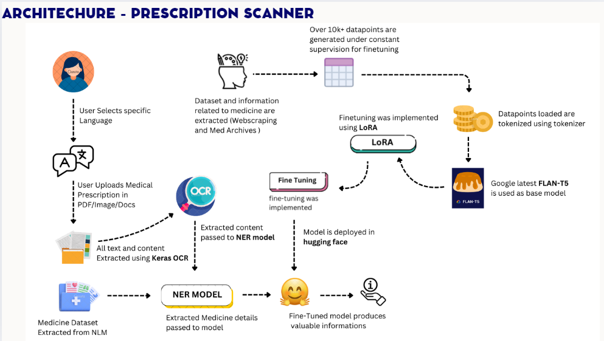
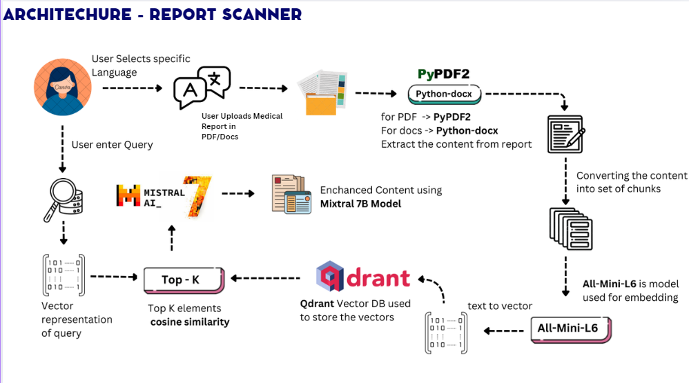

# Team Name : **Drastic Innovators**
# 🤖 INTELLICARE  : *Automated Medical Information Extraction and Patient Query Resolution Using OCR, NER, Fine-Tuned Models, and Retrieval-Augmented Generation (RAG)📑*

Welcome to **Intellicare** by Team **Drastic Innovators**! Our project aims to enhance healthcare by enabling easy access and understanding of complex medical information through advanced AI models. 🩺💊

## 📢 **Problem Statement**

In today's world, many people face significant challenges in understanding the medical information contained in doctor prescriptions and medical reports. These documents, though critical for effective healthcare, are often difficult to interpret due to complex medical jargon and unclear explanations. This lack of clarity can result in various issues, including:

### 💊 **Misuse of Medications**:

Patients often rely on prescriptions without fully understanding the medication instructions, dosages, or potential side effects. Without proper knowledge, patients might misuse medications, which can lead to ineffective treatment or even adverse health effects.

### 📄 **Complex Medical Reports**: 

Medical reports are often lengthy, filled with technical terms, and difficult to comprehend for individuals without a medical background. Important information, such as diagnoses, symptoms, and recommended treatments, may be hidden within these complex documents, preventing patients from fully understanding their health status or the steps they need to take for treatment and recovery.

---
##  🚀 Solutions
---
### 💊 **Prescription Scanner: Medication Understanding Simplified**

Our **Prescription Scanner** project is designed to help patients better understand the medications prescribed to them by leveraging **Generative AI (Gen AI)** techniques, such as:

- 🤖 **Fine-Tuned Model**: A custom fine-tuned model tailored to interpret prescription details accurately.
  
- 🧠 **AI-Powered Insights**: The system provides clear, understandable information about the medications, including dosage, potential side effects, and usage instructions.
  
This tool empowers patients to make informed decisions, improving their ability to follow treatment plans and reducing the risks of medication misuse or adverse effects. The AI system also ensures that the interpretation is simple and accessible to individuals without a medical background.

---

### 📄 **Report Scanner: Simplifying Medical Report Understanding**

Our **Report Scanner** project leverages cutting-edge technologies to interpret and summarize complex medical reports, making it easier for patients to understand their health status. Key features include:

- 📸 **OCR (Optical Character Recognition)**: Extracts text from medical reports, whether handwritten or typed.
  
- 🧑‍⚕️ **Sentence Embedding**: Uses deep learning models to understand the context and extract meaningful insights from medical reports.
  
- 📚 **Vector Databases**: Stores extracted information in vectorized form for fast and accurate retrieval.
  
- 🔄 **Retrieval-Augmented Generation (RAG)**: Combines the power of retrieval and generative models to provide precise and insightful summaries, including diagnoses, symptoms, treatments, and next steps.

This solution helps patients comprehend their medical condition by breaking down complex medical jargon, ensuring they fully understand their diagnoses, symptoms, and recommended treatments. It empowers patients to take control of their health with clarity.

---

## 📊 **Architecture Diagrams**

## **💊 Prescription Scanner Architecture**

### Prescription Scanner - Architecture Overview

### 1. User Interaction
   - 🌐 **User Selects Language**: Users can choose their preferred language for processing.
   - 📄 **File Upload**: Users upload a medical prescription in various formats (PDF, image, or document).

### 2. Text Extraction
   - 🔍 **OCR Processing**: Text and content from the uploaded document are extracted using [**Keras OCR**](https://keras-ocr.readthedocs.io/en/latest/).
   - 💊 **Medicine Dataset**: Medication-related data is extracted from trusted sources like [NLM](https://pubmed.ncbi.nlm.nih.gov/) (National Library of Medicine).

### 3. Named Entity Recognition (NER)
   - 📊 **NER Model Processing**: The extracted text is passed to a **NER model** to identify and extract specific details related to medicines.
   - 📝 **Data Extraction**: Extracted information is then structured and prepared for further analysis.

### 4. Data Collection and Fine-Tuning
   - 🗄️ **Data Generation**: Over 10,000 datapoints related to medication are generated [Kaggle](https://www.kaggle.com/datasets/shudhanshusingh/az-medicine-dataset-of-india) and [medical archives](https://ftp.ncbi.nlm.nih.gov/pubmed/baseline/), used to fine-tune the model.
   - 🔠 **Tokenization**: The generated data points are tokenized for model training.
   - 🔧 **Model Fine-Tuning**: **LoRA** (Low-Rank Adaptation) is used to fine-tune the [**FLAN-T5**](https://huggingface.co/google/flan-t5-xxl) model with the prepared dataset.

### 5. Model Deployment
   - ☁️ **Hugging Face Deployment**: The fine-tuned [model](https://huggingface.co/Karthikeyan-M3011/medflan-t5-large) is deployed on Hugging Face for easy access and scalability.

### 6. Output
   - 🤖 **Information Extraction**: The fine-tuned model analyzes the prescription and produces valuable medication details.

---

## **📄 Report Scanner Architecture**

### Report Scanner - Architecture Overview

### 1. User Interaction
   - 🌐 **User Selects Language**: Users select their preferred language.
   - 📄 **File Upload**: Users upload a medical report in PDF or DOCX format.

### 2. Content Extraction
   - 🛠️ **File Parsing**: 
     - For PDFs, [**PyPDF2**](https://pypdf2.readthedocs.io/en/3.x/) is used to extract text.
     - For DOCX files, [**Python-docx**](https://python-docx.readthedocs.io/en/latest/) is utilized for extraction.
   - 📄 **Content Extraction**: Extracted content from the report is processed.

### 3. Content Enhancement
   - 🧠 **Mixtral 7B Model**: The extracted content is enhanced for more accurate retrieval using the [**Mixtral 7B**](https://huggingface.co/mistralai/Mixtral-8x7B-v0.1) model, which improves the text content for better query response.

### 4. Text Chunking and Embedding
   - 📑 **Text Chunking**: The enhanced content is broken down into manageable chunks for efficient processing.
   - 🧬 **Embedding with All-Mini-L6**: Each chunk is converted to a vector embedding using the [**All-Mini-L6**](https://huggingface.co/sentence-transformers/all-MiniLM-L6-v2) model, making it compatible for vector search.

### 5. Vector Database Storage
   - 🗄️ **Vector Storage in Qdrant**: The vector embeddings are stored in a [**Qdrant**](https://qdrant.tech/) vector database, enabling quick retrieval based on cosine similarity.
) 
### 6. Query Processing and Retrieval
   - 🔍 **User Query**: The user inputs a query to search the report.
   - 🔢 **Query Vectorization**: The query is converted into a vector representation.
   - 🔝 **Top-K Selection**: Using cosine similarity, the system identifies the Top-K most relevant chunks related to the query.

### 7. Result Presentation
   - 📊 **Relevant Information Display**: The system retrieves and displays the most relevant sections of the report, addressing the user's query effectively.

---

🌐 **It's all about improving access to quality care**
